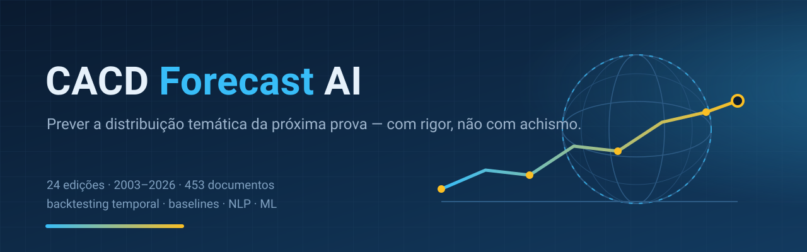

<p align="center">
  
</p>

<p align="center">
  
  
  
  
  
</p>

# CACD Forecast AI

Sistema experimental que mede, com **backtesting temporal rigoroso**, até que ponto o
histórico das provas do **Concurso de Admissão à Carreira de Diplomata (CACD)** permite
prever a **distribuição temática** da próxima edição.

> **EN — TL;DR.** A research project on whether ~24 editions (2003–2026) of the Brazilian
> diplomat entrance exam are enough to predict the *topic distribution* of the next exam —
> not the literal question. Temporal backtesting, anti-leakage, statistical baselines first,
> then NLP/ML. The hard part, as always, is the data.

---

## O que é — e o que **não** é

| É | Não é |
|---|---|
| Um estudo científico com backtesting temporal (treino 2006–X, teste X+1) | Adivinhação da questão literal |
| Comparação honesta de baselines estatísticos, NLP e ML | "Guru" que promete tema garantido |
| Probabilidade estimada, sempre com incerteza | Certeza sobre a próxima prova |

Pergunta central: *dado todo o histórico até o ano X, quais temas teriam sido previstos
para X+1 — e o que realmente caiu?*

## Como funciona

1. **Dados** — catalogação de fontes, download dos PDFs, extração de texto e segmentação
   em questões (enunciado, alternativas, gabarito, disciplina), com proveniência completa.
2. **NLP** — embeddings multilíngues, similaridade e clustering para descobrir temas e
   recorrências reais entre edições.
3. **Modelos** — features estatísticas e 4 baselines primeiro; depois ML tabular
   (XGBoost/LightGBM), modelos de decisão probabilística (Laya) e ensemble.
4. **Backtesting** — folds expansivos 2017→2025, métricas de ranking (Precision@K, NDCG@K)
   por disciplina, relatório de previsões vs. prova real.

## Status

| Etapa | Status | Artefato |
|---|---|---|
| 1. Catalogar fontes | ✅ | [`docs/etapa1-relatorio-catalogacao.md`](docs/etapa1-relatorio-catalogacao.md) |
| 2. Dados administrativos por edital | ⏳ | `data/metadata/contest_registry.csv` |
| 3. Baixar PDFs | ✅ | `scraper/download.py` + `data/raw/download_manifest.csv` |
| 4. Extrair texto | ✅ | `parser/extract_text.py` → `data/processed/text/` |
| 5. Segmentar questões + dataset | 🔄 | `parser/` → `data/processed/questions.parquet` |
| 6. Validação manual de amostra | ⏳ | `data/processed/qa_sample/` |
| 7. Taxonomia temática | ⏳ | `data/metadata/taxonomy.md` |
| 8. Embeddings + clustering | ⏳ | `nlp/` |
| 9. Features + 4 baselines | ⏳ | `features/`, `models/baseline/` |
| 10. ML + Laya + ensemble | ⏳ | `models/` |
| 11. Backtesting + avaliação | ⏳ | `evaluation/` |
| 12. Dashboard + simulados | ⏳ | `api/`, `frontend/` |

### Qualidade do dataset por período

| Período | Banca / formato | Situação |
|---|---|---|
| 2019–2023 | IADES (certo/errado) | ✅ usável (~90% de gabarito casado) |
| 2025–2026 | Cebraspe (atual) | ✅ usável (100%) |
| 2024 | Cebraspe (transição) | ⚠️ parcial |
| 2003–2018 | CESPE / formatos antigos | ❌ em correção (provas em 2 colunas, gabaritos multi-caderno) |

> Transparência: a maior dificuldade do projeto **não** é modelar — é **levantar os dados**.
> Bancas diferentes, provas em duas colunas, gabaritos com múltiplos cadernos e provas
> escaneadas tornam a extração a parte mais árdua. Isso está documentado, não escondido.

## Estrutura do repositório

```
├── data/
│   ├── metadata/        # catálogos de fontes e proveniência
│   ├── raw/             # PDFs baixados, por edição e família de fonte
│   ├── processed/       # datasets, métricas e amostras de QA
│   └── embeddings/      # vetores de questões
├── scraper/             # download dos PDFs catalogados
├── parser/              # extração de texto e segmentação de questões
├── nlp/                 # embeddings, similaridade, clustering
├── features/            # features estatísticas por tema
├── models/              # baselines, xgboost, laya, ensemble
├── evaluation/          # métricas @K e backtesting temporal
├── tests/               # pytest
└── docs/                # relatórios, planejamento e assets
```

## Dados e proveniência

Prioridade de fonte: **MRE/IrBr > Cebraspe > Wayback (oficial arquivado) > repositórios secundários**.

- **Oficial vivo:** 2017–2018, 2024–2026 (Cebraspe)
- **Oficial arquivado:** 2013–2016 (Wayback, domínio legado)
- **Secundária:** 2003–2012 e 2019–2023 (banca IADES)

Cada questão do dataset carrega `source_type` e `source_url`. URL só é registrada após
verificação; ausências são `NOT_FOUND` explícitos. Os **PDFs originais ficam no repositório**
(`data/raw/`), para que qualquer pessoa possa conferir as fontes e reproduzir a extração —
cada arquivo é rastreável à sua URL de origem em `data/raw/download_manifest.csv`.

## Como reproduzir

```bash
pip install -r requirements.txt
python scraper/download.py --dry-run   # lista os jobs de download
python scraper/download.py             # baixa (retomável, com SHA-256)
python parser/extract_text.py          # extrai texto + métricas de qualidade
python parser/build_dataset.py         # gera questions.parquet + extraction_report
python parser/qa.py --n 5              # amostra para revisão manual
```

## Princípios do projeto

- **Backtesting temporal obrigatório** — janela expansiva (treino 2006–X, teste X+1); nunca split aleatório.
- **Anti-leakage** — taxonomia, TF-IDF e embeddings re-fitados por fold; eventos filtrados por data < prova.
- **Métricas de ranking** — Precision@K, Recall@K, F1@K, MAP@K, NDCG@K (por disciplina também).
- **Baselines antes de IA** — nenhum modelo "inteligente" sem comparar com os 4 baselines estatísticos.
- **Transparência** — todo score é probabilidade estimada; conteúdo de LLM sempre marcado `GERADA POR IA`.
- **Proveniência total** — cada dado rastreável à fonte; provas de cursinho nunca tratadas como oficiais.

## Roadmap

- [x] Catalogação de fontes e download do corpus
- [x] Extração de texto e parser base (Cebraspe/IADES)
- [ ] Fechar Etapa 5: objetivas 2003–2018 + 2024, discursivas, caderno do gabarito
- [ ] Etapa 2: dados administrativos por edição
- [ ] Taxonomia temática + baselines + primeiro backtest
- [ ] ML/NLP, dashboard e simulados

## Aviso

Projeto de **pesquisa e estudo**, sem qualquer vínculo com o Ministério das Relações
Exteriores, o Instituto Rio Branco, o Cebraspe ou o IADES. Não há garantia de acurácia.
Use por sua conta e risco.

## Licença

- **Código:** MIT — ver [`LICENSE`](LICENSE).
- **Dados derivados e documentação:** CC BY 4.0 — ver [`LICENSE-DATA.md`](LICENSE-DATA.md).

---

<p align="center"><sub>Feito com café, PyMuPDF e uma quantidade suspeita de paciência com PDFs.</sub></p>
